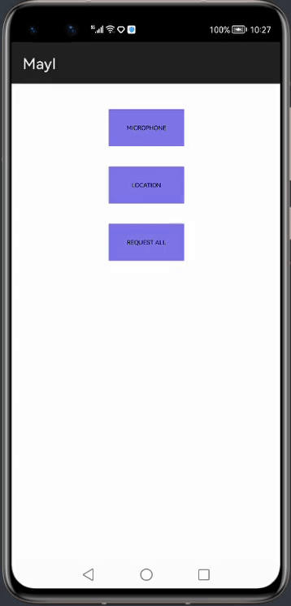

# MayI

MayI is yet another library that simplifies the process of requesting permissions at runtime for Harmony devices.

## Screenshot

​
## Source
This library is inspired by the [MayI](https://github.com/ThanosFisherman/MayI-Java) library version 1.5
​
## Features
A new functionality has been added that lets users grant or deny permissions while an app is running instead of granting them all together when installing it. This approach gives the user more control over applications but requires developers to add lots of code to support it.

This library aims to reduce boilerplate code needed to request permissions at runtime by featuring a simple chainable API designed the way I want it.
​
## Dependency
1. For using Mayi module in sample app, include the source code and add the below dependencies in entry/build.gradle to generate hap/mayi.har.
```java
dependencies {
    implementation project(':mayi')
    implementation fileTree(dir: 'libs', include: ['*.har'])
    testCompile 'junit:junit:4.12'
}
```
2. For using Mayi in separate application using har file, add the har file in the entry/libs folder and add the dependencies in entry/build.gradle file.
```java
dependencies {
    implementation fileTree(dir: 'libs', include: ['*.har'])
    testCompile 'junit:junit:4.12'
}
```
​
## Usage
### Add onRequestPermissionsFromUserResult in MainAbility
To get the result of the permission requests, we need to have this overridden method in MainAbility:

```java
@Override
public void onRequestPermissionsFromUserResult(int requestCode, String[] permissions, int[] grantResults) {
    super.onRequestPermissionsFromUserResult(requestCode, permissions, grantResults);
    PermissionManager permissionManager = PermissionManager.getInstance();
    permissionManager.requestPermissionsResult(requestCode, permissions, grantResults);
    permissionManager.closeSlice();
}
```
### Single Permission
To request a **single permission** using this library, you just need to call `Mayi` with a valid `AbilitySlice` and use `withPermission` method:

```java
public class MainAbilitySlice extends AbilitySlice {
    @Override
    public void onStart(Intent intent) {
	super.onStart(intent);
	Mayi.withActivity(MainAbilitySlice.this)
	.withPermission(SystemPermission.MICROPHONE)
	.onResult(permission -> permissionResultSingle(permission))
	.onRationale((permission, token) -> permissionRationaleSingle(permission,token))
	.check();
   }
}
```

`permissionResultSingle` and `permissionRationaleSingle` could be custom-defined methods of your own that would deal accordingly in each situation. For Example:

```java
private void permissionResultSingle(PermissionBean permission) {
    new ToastDialog(getContext()).setText("PERMISSION RESULT " + permission.toString()).show();
}
 
private void permissionRationaleSingle(PermissionBean bean, PermissionToken token) {
    new ToastDialog(getContext()).setText("Should show rationale for " + bean.getSimpleName() + " permission").show();
    token.skipPermissionRequest();   
}
```
### Multiple Permissions
Similarly to request **multiple permissions** at once, you just need to call `Mayi` with a valid `AbilitySlice` but this time use `withPermissions` method to specify more than one permissions. Furthermore
the lambda expressions from the example above could be replaced with method references like so:

```java
public class MainAbilitySlice extends AbilitySlice{
    @Override
    public void onStart(Intent intent) {
        super.onStart(intent);
        Mayi.withActivity(this)
        .withPermission(SystemPermission.MICROPHONE, SystemPermission.LOCATION)
        .onRationale(this::permissionRationaleMulti)
        .onResult(this::permissionResultMulti)
        .check();
    }
}
```

Again possible custom-defined methods for the above example could be something like:

```java
private void permissionResultMulti(PermissionBean[] permissions) {
    new ToastDialog(getContext()).setText("MULTI PERMISSION RESULT " + Arrays.deepToString(permissions)).show();

private void permissionRationaleMulti(PermissionBean[] permissions, PermissionToken token) {
    new ToastDialog(getContext()).setText("Rationales for Multiple Permissions " + Arrays.deepToString(permissions)).show();
    token.continuePermissionRequest();
}
```

### Error handling
If you think there is going to be an error in your Mayi integration, just call a `onErrorListener`:

```java
    Mayi.withActivity(this)
    .withPermissions(SystemPermission.MICROPHONE, SystemPermission.LOCATION)
    .onRationale(this::permissionRationaleMulti)
    .onResult(this::permissionResultMulti)
    .onErrorListener(this::inCaseOfError)
    .check());
    
private void inCaseOfError(Exception e) {
    new ToastDialog(getContext()).setText("ERROR " + e.toString()).show();
}
```

The library will then notify you when something unexpected happens.

## Library Flow
* The first time this library runs, a new slice appears and `onRationale()` is called.

  Inside `onRationale` method you now have 3 options. 
    * Call `token.continuePermissionRequest()` method which shows again system dialog prompt and then calls `onResult()` that includes the user's choice.
    * Call `token.skipPermissionRequest()` method which will skip showing system dialog prompt and immediately call `onResult()` that includes the user's choice.
    * Call none of the 2 above thus terminating the flow after `onRationale` finishes its execution.
* If user denied the permission by checking _"don't ask again"_ then `onResult()` will be called that includes the result of the user's choice. You may check whether the permission has been permanently denied via the `PermissionBean#isPermanentlyDenied()` method which is included in the `onResult()`.

Below is a flow chart that visualizes the library's flow described above.


​
## Future work
In our version, the flow directly goes to the onRationale() for the first time, while it should ask the user permission through a system dialog prompt. This is due to the absence of platform support that we can find if we need to show a rationale before asking for an user permisssion. Once we have this platform support, we can add the feature of asking permission for the first time without showing rationale.

## License
[](https://www.apache.org/licenses/LICENSE-2.0.html)

    Copyright 2017 Thanos Psaridis

    Licensed under the Apache License, Version 2.0 (the "License");
    you may not use this file except in compliance with the License.
    You may obtain a copy of the License at

       http://www.apache.org/licenses/LICENSE-2.0

    Unless required by applicable law or agreed to in writing, software
    distributed under the License is distributed on an "AS IS" BASIS,
    WITHOUT WARRANTIES OR CONDITIONS OF ANY KIND, either express or implied.
    See the License for the specific language governing permissions and
    limitations under the License.

